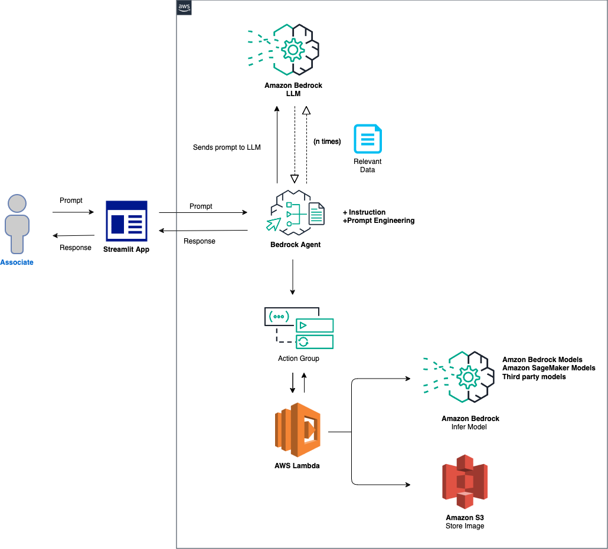
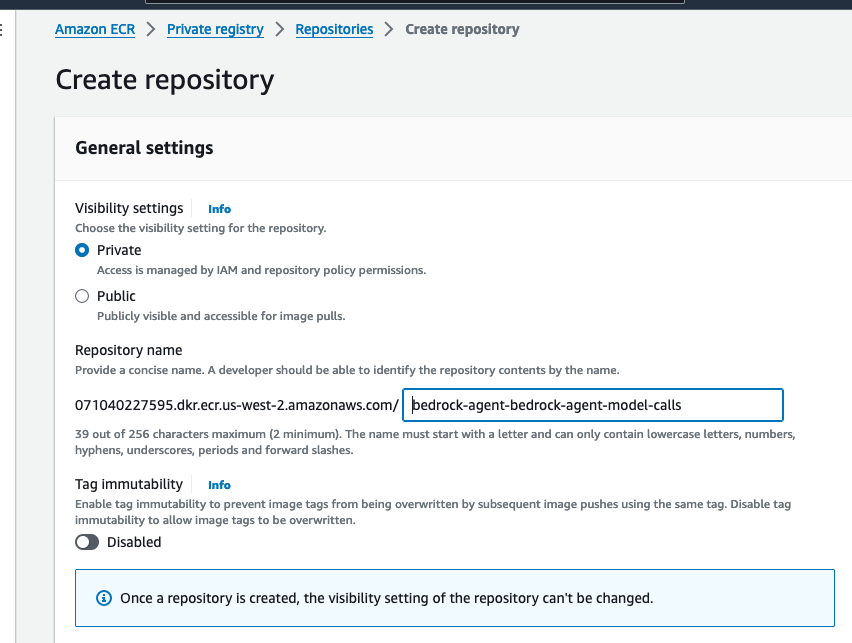
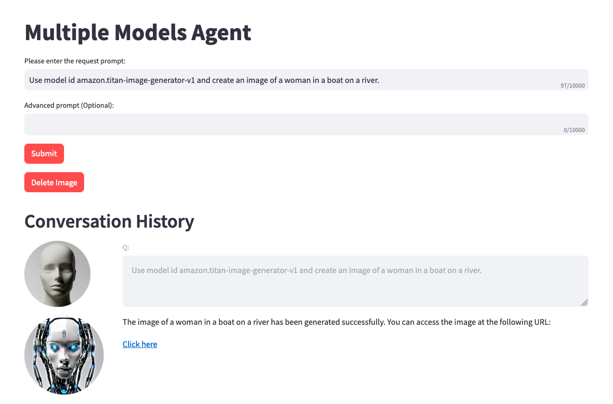

# Setup Amazon Bedrock agent to Infer various LLMs.

## Introduction
This project is intended to be a baseline for builders to extend there use cases across various LLMs via Amazon Bedrock agents. The intent is to show the art of the possible leveraging all available models on Bedrock for chained responses to fit different use cases. This README is a guide to setting this up, giving you the ability to further explore the power of agents with the latest models on Amazon bedrock. 

## Prerequisites
- An active AWS Account.
- Familiarity with AWS services like Amazon Bedrock, S3, Lambda, and Cloud9 , and Docker.
- All models that you plan to test will need to be granted access via Amazon Bedrock. 


## Use cases for this project
- Multiple model result comparison
- Text generation 
- Summarization
- Text-to-sql
- Text-to-image
- Image-to-text
- Image rating
- Problem solving
- Q&A
- RAG (optional)
- Other


## Models this project currently supports:

### Anthropic: Claude
- anthropic.claude-3-haiku-20240307-v1:0
- anthropic.claude-3-sonnet-20240229-v1:0
- anthropic.claude-v2:1
- anthropic.claude-v2
- anthropic.claude-instant-v1

### Mistral: models
- mistral.mistral-large-2402-v1:0
- mistral.mistral-7b-instruct-v0:2
- mistral.mixtral-8x7b-instruct-v0:1

### Amazon: Titan Models
- amazon.titan-text-lite-v1
- amazon.titan-text-express-v1
- amazon.titan-image-generator-v1 (in preview)

### Meta: Llama models
- meta.llama2-13b-chat-v1
- meta.llama2-70b-chat-v1

### Cohere: Command Models
- cohere.command-text-v14
- cohere.command-light-text-v14

### Stability AI: SDXL Models
- stability.stable-diffusion-xl-v0
- stability.stable-diffusion-xl-v1

### AI21labs: Jurassic models
- ai21.j2-ultra-v1
- ai21.j2-mid-v1


## Diagram




## Configuration and Setup

### Step 1: Creating an Amazon S3 bucket
- This step will be required in order to do image-to-text and text-to-image inference to certain models. Also, make sure that you are in the **us-west-2** region. If another region is required, you will need to update the region in the `invoke_agent.py` file on line 26 of the project code. 

- Create an S3 bucket, and call it `bedrock-agent-images-{alias}`. The rest of the settings will remain default. ***Make sure to update {alias} with the correct value throughout this project**

- Next, upload the sample image from [here](https://github.com/jossai87/bedrock-agent-call-multiple-models/blob/main/images/generated_pic.png), to this S3 bucket.


### Step 2: Create an Amazon ECR (Elastic Container Registry)

- We will need to create a container registry in [ECR (Elastic Container registry)](https://aws.amazon.com/ecr/). This will be used to store our Docker container image for our Lambda function. 

- Log into the management console, and search `ECR` in the search bar at the top. Select the service, then ***Create repository***.


- Provide a repo name. Lets call it `bedrock-agent-bedrock-agent-model-calls`. Leave the other options as default. Scroll to the bottom, then create the repository. 




### Step 3: Download project. Setup & run Docker

- Download the sample project from [here](https://github.com/jossai87/bedrock-agent-call-multiple-models/archive/refs/heads/main.zip). 

-  Once downloaded, **unzip the file**:

- Open up the project in your IDE of choice. For this project, I will be using [Visual Studio code](https://code.visualstudio.com/docs/sourcecontrol/intro-to-git). Please review the code briefly. 

- We will need to run Docker in order to create a docker container image that will be used for our Lambda function. This function will be used with the action group of the agent in order to infer your model of choice. 

- Navigate to the root directory of the project `bedrock-agent-call-multiple-models` in your IDE. Open a terminal here is well. 

- The commands below can be used to login your ECR, then build, tag, and push your Docker container image to ECR. **Make sure to update the {account-number} in the commands throughout this project. Region us-west-2 is assumed.**

   ```bash 
   aws ecr get-login-password --region us-west-2 | docker login --username AWS --password-stdin {account-number}.dkr.ecr.us-west-2.amazonaws.com 
   ```
   ```bash 
   docker build -t app1:local -f Dockerfile.app1 . 
   ```
   ```bash 
   docker tag app1:local {account-number}.dkr.ecr.us-west-2.amazonaws.com/bedrock-agent-model-calls:latest 
   ```
   ```bash 
   docker push {account-number}.dkr.ecr.us-west-2.amazonaws.com/bedrock-agent-bedrock-agent-model-calls:latest 
   ```


***More documentation on setting up ECR & installing Docker can be found [here](https://docs.aws.amazon.com/AmazonECR/latest/userguide/getting-started-cli.html).***


### Step 4: Lambda function creation
- Now we create a Lambda function (Python 3.12) for the bedrock agent's action group using the container image from the previous step. Navigate back to the AWS management console, then in the search bar, type `Lambda` then selct the service.

- Select `Create function`. Then select the `Container image` radio button from the top 3 options.

- We will call this Lambda function `bedrock-agent-model-call`. For `Container image URI`, browse the images, select repo `bedrock-agent-bedrock-agent-model-calls`, then the latest image. 

- Leave the other options as default, then select the button ***Create function***.

- Once the Lambda function is created, we need to provide the bedrock agent permissions to invoke it. Scroll down and select the `Configuration` tab. On the left, select `Permissions`. Scroll down to **Resource-based policy statements** and select `Add permissions`.

- Select `AWS service` in the middle for your policy statement. Choose `Other` for your service, and put `allow-agent` for the StatementID. For the Principal, put `bedrock.amazonaws.com `.

- Enter `arn:aws:bedrock:us-west-2:{aws-account-id}:agent/* `. ***Please note, AWS recommends least privilage so only the allowed agent can invoke this Lambda function***. A `*` at the end of the ARN grants any agent in the account access to invoke this Lambda. Ideally, we would not use this in a production environment. Lastly, for the Action, select `lambda:InvokeAction`, then ***Save***.


### Step 5: Setup Bedrock agent and action group 
- Navigate to the Bedrock console. Go to the toggle on the left, and under **Orchestration** select `Agents`. Provide an agent name, like **multi-model-agent** then create the agent.

- The agent description is optional, and we will use the default new service role. For the model, select **Anthropic Claude V2.1**. Next, provide the following instruction for the agent:

```instruction
You are an research agent that interacts with various models to do tasks and return information. You use the model ID and prompt from the request, then use your available tools to call models. You use these models for text/code generation, summarization, problem solving, text-to-sql, response comparisons and ratings. You also allow models to do image-to-text. Models can also do text-to-image, while returning a url similar to this example {url_example}. You are only allowed to retrieve information the way I ask. Do not decide when to provide your own response, unless you ask. Return every response in clean format.
```

- Next, we will add an action group. Scroll down to `Action groups` then select ***Add***.

- Call the action group `call-model`. For the Lambda function, we select `bedrock-agent-model-call`.

- For the API Schema, we will choose `Define with in-line OpenAPI schema editor`. Copy & paste the schema from below into the **In-line OpenAPI schema** editor, then select ***Add***:
`(This API schema is needed so that the bedrock agent knows the format structure and parameters needed for the action group to interact with the Lambda function.)`

```schema
{
  "openapi": "3.0.0",
  "info": {
    "title": "Model Inference API",
    "description": "API for inferring a model with a prompt, and model ID.",
    "version": "1.0.0"
  },
  "paths": {
    "/callModel": {
      "post": {
        "description": "Call a model with a prompt, model ID, and an optional image",
        "parameters": [
          {
            "name": "modelId",
            "in": "query",
            "description": "The ID of the model to call",
            "required": true,
            "schema": {
              "type": "string"
            }
          },
          {
            "name": "prompt",
            "in": "query",
            "description": "The prompt to provide to the model",
            "required": true,
            "schema": {
              "type": "string"
            }
          }
        ],
        "requestBody": {
          "required": true,
          "content": {
            "multipart/form-data": {
              "schema": {
                "type": "object",
                "properties": {
                  "modelId": {
                    "type": "string",
                    "description": "The ID of the model to call"
                  },
                  "prompt": {
                    "type": "string",
                    "description": "The prompt to provide to the model"
                  },
                  "image": {
                    "type": "string",
                    "format": "binary",
                    "description": "An optional image to provide to the model"
                  }
                },
                "required": ["modelId", "prompt"]
              }
            }
          }
        },
        "responses": {
          "200": {
            "description": "Successful response",
            "content": {
              "application/json": {
                "schema": {
                  "type": "object",
                  "properties": {
                    "result": {
                      "type": "string",
                      "description": "The result of calling the model with the provided prompt and optional image"
                    }
                  }
                }
              }
            }
          }
        }
      }
    }
  }
}
```


- Now we will need to modify the **Advanced prompts**. Select the orange **Edit in Agent Builder** button at the top. Scroll down to advanced prompts, then select `Edit`.

- In the `Advanced prompts` box under `Pre-processing template`, enable the `Override pre-processing template defaults` option. Also, make sure that `Activate pre-processing template` is disabled. This is so that we will bypass the possibility of deny responses. We are choosing this option for simplicity. Ideally, you would modify these prompts to allow only what is required. 

- In the `Prompt template editor`, go to line 19 or 20 and Copy & paste the following prompt:

```prompt
Here is an example of what a url response to access an image should look like:
<url_example>
  URL Generated to access the image:
  
  https://bedrock-agent-images.s3.amazonaws.com/generated_pic.png?AWSAccessKeyId=123xyz&Signature=rlF0gN%2BuaTHzuEDfELz8GOwJacA%3D&x-amz-security-token=IQoJb3JpZ2luX2VjENH%2F%2F%2F%2F%2F%2F%2F%2F%2F%2FwEaCXVzLXdlc3QtMiJIMEYCIQDhxW1co7u3v0O5rt59gRQ6VzD2QEuDHuNExjM5IMnrbAIhANlEfIUbJYOakD40l7T%2F36oxQ6TsHBYJiNMOJVqRKUvhKo8DCPr%2F%2F%2F%2F%2F%2F%2F%2F%2F%2FwEQARoMMDcxMDQwMjI3NTk1IgwzlaJstrewYckoQ48q4wLgSb%2BFWzU7DoeopqbophcBtyQVXc4g89lT6durG8qVDKZFPEHHPHAq8br7tmMAywipKvq5rqY8Oo2idUJbAg62FWKVRzT%2FF1UXRmsqKr6cs7spmIIbIkpyi3UXUhyK%2FP%2BhZyUJ%2BCVQTvn2DImBxIRAd7s2h7QzDbN46hyizdQA%2FKlfnURokd3nCZ2svArRjqyr0Zvm%2BCiJVRXjxAKrkNRNFCuaKDVPkC%2F7BWd3AO3WlXPtJZxUriP28uqDNuNsOBU5GMhivUv%2BTzzZdlDlgaSowxZDeWXZyoFs4r4CUW0jMUzdJjOKKTghfOukbguz8voah16ZSI22vbLMruUboBc3TTNRG145hKcGLcuFNywjt2r8fLyxywl8GteCHxuHC667P40U2bOkqSDVzBE4sLQyXJuT%2BaxyLkSsjIEDWV0bdtQeBkptjT3zC8NrcFRx0vyOnWY7aHA0zt1jw%2BfCbdKmijSfMOqo0rAGOp0B098Yen25a84pGd7pBJUkyDa0OWUBgBTuMoDetv%2FfKjstwWuYm1I%2BzSi8vb5HWXG1OO7XLs5QKsP4L6dEnbpq9xBj9%2FPlwv2YcYwJZ6CdNWIr7umFM05%2FB5%2FI3epwN3ZmgJnFxCUngJtt1TZBr%2B7GOftb3LYzU67gd2YMiwlBJ%2BV1k6jksFuIRcQ%2FzsvDvt0QUSyl7xgp8yldZJu5Jg%3D%3D&Expires=1712628409
</url_example>
```


- This prompt helps provide the agent an example on formatting the response of a presigned url when images are generated. Additionally, there is an option to use a [custom parser Lambda function](https://docs.aws.amazon.com/bedrock/latest/userguide/lambda-parser.html) for more granular formatting. 

- Scroll to the bottom and select the `Save and exit` button.


### Step 6: Test various models

- On the right, you should see an option  to test the agent with a user input field. Below are a few prompts that you can test. However, we encourage you to become creative and test variations of input. 

- One thing to note before testing. When you do text-to-image or image-to-text, the project code references the same .png file statically. In an ideal environment, this step can be configured to be more dynamically.

``` prompt
Use model amazon.titan-image-generator-v1 and create me an image of a woman in a boat on a river.
```

```prompt
Use model anthropic.claude-3-haiku-20240307-v1:0 and describe to me the image that is uploaded. The model function will have the information needed to provide a response. So, dont ask about the image.
```

``` prompt
Use model stability.stable-diffusion-xl-v0. Create an image of an astronaut riding a horse in the desert.
```

``` prompt
Use model ai21.j2-mid-v1. You are a gifted copywriter, with special expertise in writing Google ads. You are tasked to write a persuasive and personalized Google ad based on a company name and a short description. You need to write the Headline and the content of the Ad itself. For example: Company: Upwork Description: Freelancer marketplace Headline: Upwork: Hire The Best - Trust Your Job To True Experts Ad: Connect your business to Expert professionals & agencies with specialized talent. Post a job today to access Upwork's talent pool of quality professionals & agencies. Grow your team fast. 90% of customers rehire. Trusted by 5M+ businesses. Secure payments. - Write a persuasive and personalized Google ad for the following company. Company: Click Description: SEO services
```


***(If you would like to have a UI setup with this project, continue to step 7)***

## Step 7: Setting up and running the Streamlit app

- You will need to have an `agent alias ID`, along with the `agent ID` for this step. Go to the Bedrock management console, then select your multi-model agent. Copy the `Agent ID` from the top-right of the `Agent overview` section. Then, scroll down to **Aliases** and select ***Create***. Name the alias `a1`, then create the agent. Save the `Alias ID` generated.

- now, navigate back to the IDE you used to open up the project.
     
-  **Navigate to Streamlit_App Folder**:

   - Change to the directory containing the Streamlit app:

    ***macOS/Linux***
     ```linux
     cd ~/environment/bedrock-agents-multiple-models/streamlit_app
     ```

     ***Windows***
     ```windows
     cd %USERPROFILE%\environment\bedrock-agents-multiple-models\streamlit_app
     ```

-  **Update Configuration**:
   - Open the `invoke_agent.py` file.

   - On line 23 & 24, update the `agentId` and `agentAliasId` variables with the appropriate values, then save it.


-  **Install Streamlit** (if not already installed):
   - Run the following command to install all of the dependencies needed:

     ```bash
     pip install streamlit boto3 pandas
     ```

-  **Run the Streamlit App**:
   - Execute the command:
     ```bash
     streamlit run app.py
     ```
  
     
   - Once the app is running, please test some of the sample prompts provided. (On 1st try, if you receive an error, try again.)




   - Optionally, you can review the [trace events](https://docs.aws.amazon.com/bedrock/latest/userguide/trace-events.html) in the left toggle of the screen. This data will include the **Preprocessing, Orchestration**, and **PostProcessing** traces.


## Security

See [CONTRIBUTING](CONTRIBUTING.md#security-issue-notifications) for more information.

## License

This library is licensed under the MIT-0 License. See the LICENSE file.