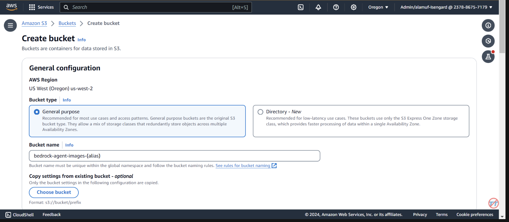
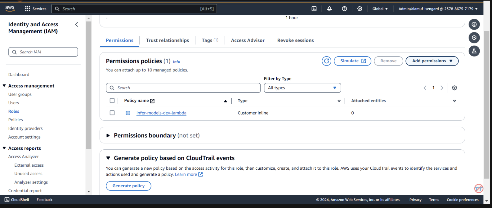
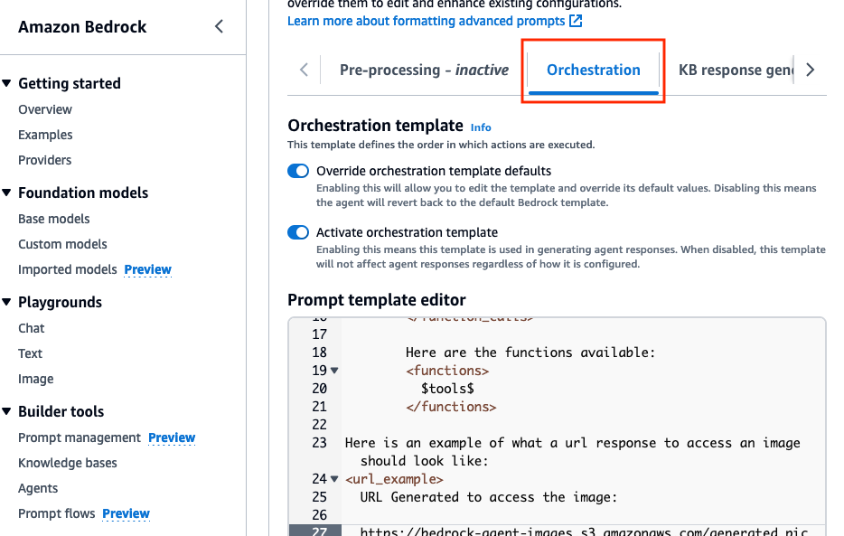
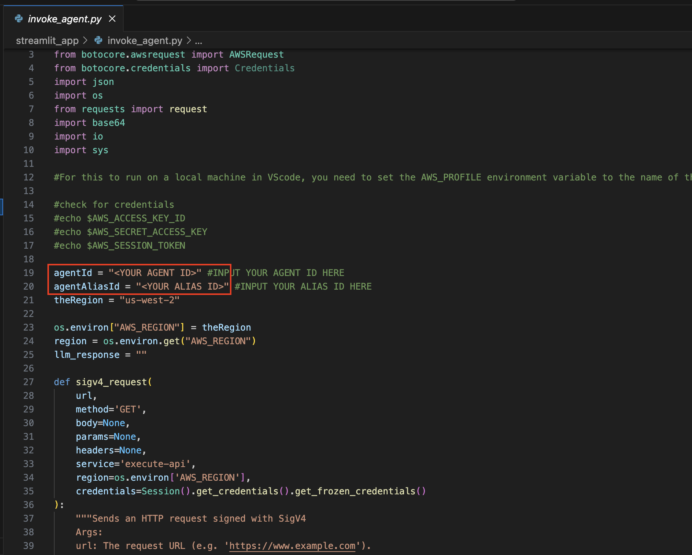
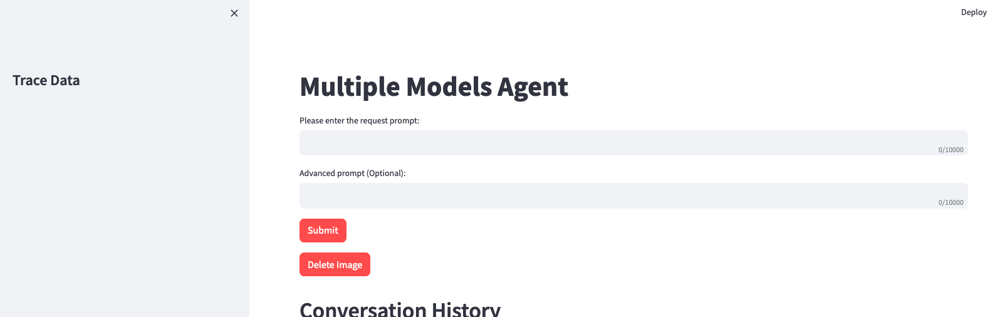

# Inferring Use Case-Specific LLMs through Bedrock Agents

## Introduction
This project serves as a baseline for developers to extend their use cases across various large language models (LLMs) using Amazon Bedrock agents. The goal is to showcase the potential of leveraging multiple models on Bedrock to create chained responses that adapt to diverse scenarios. 

For those who prefer an Infrastructure-as-Code (IaC) approach, we also provide an AWS CloudFormation template that sets up the core components like an Amazon Bedrock agent, S3 bucket, and a Lambda function. If you'd prefer to deploy this project via AWS CloudFormation, please refer to the workshop guide [here](https://catalog.us-east-1.prod.workshops.aws/workshops/f8a7a3f8-1603-4b10-95cb-0b471db272d8/en-US/module8-various-models-cfn/step15).

Alternatively, this README will walk you through the step-by-step process to manually set up and configure Amazon Bedrock agents via the AWS Console, giving you the flexibility to experiment with the latest models and fully unlock the potential of Bedrock agents.

## Prerequisites
- An active AWS Account.
- Familiarity with AWS services like Amazon Bedrock, S3, Lambda, and Serverless Application Model.
- All models that you plan to test will need to be granted access via Amazon Bedrock.
- Install AWS CLI (refer to this page if for further instructions) 
- Node.js (version >= 18.0.0)
- npm (Node.js package manager


## Diagram


***The high-level overview of the solution is as follows:***

Agent and Environment Setup: The solution begins by configuring an Amazon Bedrock agent, an AWS Lambda function, and an Amazon S3 bucket. This step establishes the foundation for model interaction and data handling, preparing the system to receive and process prompts from a front-end application.
Prompt Processing and Model Inference: When a prompt is received from the front-end application, the Bedrock agent evaluates and dispatches the prompt, along with the specified model ID, to the Lambda function using the action group mechanism. This step leverages the action group's API schema for precise parameter handling, facilitating effective model inference based on the input prompt.
Data Handling and Response Generation: For tasks involving image-to-text or text-to-image conversion, the Lambda function interacts with the S3 bucket to perform necessary read or write operations on images. This step ensures the dynamic handling of multimedia content, culminating in the generation of responses or transformations dictated by the initial prompt.

In the following sections, we will guide you through:

- Setting up S3 bucket
- Downloading the project and deploying the lambda function using sls-dev-tools
- Defining Bedrock Agent and Action group
- Deploying and testing the solution with various models and prompts
- (Optional) Setting up a Streamlit app for an interactive front-end


## Configuration and Setup

### Step 1: Creating an Amazon S3 bucket

- Create an S3 bucket called `bedrock-agent-images-{alias} leave the rest of the settings as default, and ***ensure you update {alias} with the correct value throughout the project***. 
- This step is required to perform image-to-text and text-to-image inference for certain models. Make sure you are in the us-west-2 region; if another region is required, you will need to update the region in the invoke_agent.py file on line 26 of the project code.
- Next, upload the sample image from [here](https://github.com/build-on-aws/bedrock-agents-infer-models/blob/main/images/the_image.png), to this S3 bucket.



### Step 2: Downloading the project and creating a lambda function using a Serverless approach

- Download the sample project from [here](https://github.com/build-on-aws/bedrock-agents-infer-models/archive/refs/heads/main.zip).
- Once downloaded, unzip the file.
- Open up the project in your IDE of choice. For this project, we will be using [Visual Studio code](https://code.visualstudio.com/docs/sourcecontrol/intro-to-git). Please review the code briefly.
- We will need to use a serverless approach to deploy our Lambda function. This function will be used with the action group of the agent in order to infer your model of choice.

 [AWS SAM (Serverless Application Model)](https://aws.amazon.com/serverless/sam/) is an open-source framework that helps you build serverless applications on AWS. It simplifies the deployment, management, and monitoring of serverless resources such as AWS Lambda, Amazon API Gateway, Amazon DynamoDB, and more. [Here's a comprehensive guide on how to set up and use AWS SAM](https://docs.aws.amazon.com/serverless-application-model/latest/developerguide/using-sam-cli.html).

The Framework simplifies the process of creating, deploying, and managing serverless applications by abstracting away the complexities of cloud infrastructure. It provides a unified way to define and manage your serverless resources using a configuration file and a set of commands.

- Navigate to the root directory of the project bedrock-agent-infer-models-sls in your IDE. Open a terminal here.
- The commands below will allow us to use sls-dev-tools to build and deploy our Lambda function. Make sure the region is set to us-west-2. The commands can also be found in the RUN_Commands.txt file
- Update AWS Credentials Open your terminal and run the aws configure command to update your AWS credentials. You'll be prompted to enter your AWS Access Key ID, AWS Secret Access Key, AWS Region, and an output format. You can check more information on AWS CLI [here](https://docs.aws.amazon.com/serverless-application-model/latest/developerguide/prerequisites.html#prerequisites-install-cli). 


- Open the **infer-models/handler.py** document and on line 19 change the s3 bucket name to the one you created earlier 
- Next step is to install the Serverless Framework globally. Run the command ***npm install -g serverless*** within your terminal. This will install the Serverless Framework on your system, allowing you to use its commands from any directory. If you encounter a node unsupported engine error, refer to the troubleshooting section below.


- Create a new Serverless project with a Python template. In your terminal, run the following commands:

  1.)
  ```cd infer-models ```
  
  2.)
  ```npm install serverless-python-requirements --save-dev ```
  
  ***(The serverless-python-requirements plugin helps manage Python dependencies for your Serverless project)***
   
  
  3.)
  ```npx sls deploy ```

  ***(This will package and deploy the AWS Lambda function)***
  

- Inspect the deployment within CloudFormation in the AWS Console

  
 

- If your stack fails to deploy, please comment out line 2 of the **serverless.yml file** 
  
 


- We need to provide the bedrock agent permissions to invoke the lambda function. Open the lambda function and scroll down to select the ***Configuration*** tab. On the left, select *Permissions*. Scroll down to Resource-based policy statements and select Add permissions.
- Select ***AWS service*** in the middle for your policy statement. Choose ***Other*** for your service, and put ***allow-agent*** for the StatementID. For the Principal, put ***bedrock.amazonaws.com*** .
- Enter `arn:aws:bedrock:us-west-2:{aws-account-id}:agent/*`. Please note, AWS recommends least privilege so only the allowed agent can invoke this Lambda function. A * at the end of the ARN grants any agent in the account access to invoke this Lambda. Ideally, we would not use this in a production environment. Lastly, for the Action, select *lambda:InvokeFunction*, then Save.
 

- To help with inference, we will increase the CPU/memory on the Lambda function. We will also increase the timeout to allow the function enough time to complete the invocation. Select ***General configuration*** on the left, then ***Edit*** on the right.

- Change Memory to **2048 MB** and timeout to **1 minute**. Scroll down, and select Save.

  

- Now we need to provide permissions to the Lambda function to read & write to S3 bucket ***bedrock-agent-images-{alias}***. This will allow the Lambda function to save & read images from the bucket. While on the Lambda console, select ***Permissions*** on the left, then select the ***role*** name hyperlink.
- In the Permissions policies section, select ***Add permissions***, then Attach policies. search for, then add AWS managed policy ***AmazonS3FullAccess*** to the role. It is best practice to provide least privilege permissions to the role instead of granting S3 full access. We are choosing this option now for simplicity. Similarly attach ***AmazonBedrockFullAccess*** to it. 

 


### Step 4: Setup Bedrock agent and action group 
- Navigate to the Bedrock console. Go to the toggle on the left, and under **Builder Tools** select `Agents`. Provide an agent name, like **multi-model-agent** then create the agent.
 
- The agent description is optional, and we will use the default new service role. For the model, select **Anthropic Claude 3 Haiku**. Next, provide the following instruction for the agent:


```instruction
You are a research agent that interacts with various large language models.  You pass the model ID and prompt from requests to large language models to create and store images. Then, the LLM will  return a presigned URL to the image similar to the URL example provided. You also call LLMS for text and code generation, summarization, problem solving, text-to-sql, response comparisons and ratings. Remeber. you use other large language models for inference. Do not decide when to provide your own response, unless asked. 
```

- After, make sure you scroll to the top and select the ***Save*** button before moving to the next step.

- Next, we will add an action group. Scroll down to `Action groups` then select ***Add***. Call the action group `call-model`.
  
- For the Action groupt type, choose **Define with API schemas**
  
- The next section, we will select an existing Lambda function **infer-models-dev-inferModel**.

- For the API Schema, we will choose `Define with in-line OpenAPI schema editor`. Copy & paste the schema from below into the **In-line OpenAPI schema** editor, then select ***Add***:
 
`(This API schema is needed so that the bedrock agent knows the format structure and parameters required for the action group to interact with the Lambda function.)`

```schema
{
  "openapi": "3.0.0",
  "info": {
    "title": "Model Inference API",
    "description": "API for inferring a model with a prompt, and model ID.",
    "version": "1.0.0"
  },
  "paths": {
    "/callModel": {
      "post": {
        "description": "Call a model with a prompt, model ID, and an optional image",
        "parameters": [
          {
            "name": "modelId",
            "in": "query",
            "description": "The ID of the model to call",
            "required": true,
            "schema": {
              "type": "string"
            }
          },
          {
            "name": "prompt",
            "in": "query",
            "description": "The prompt to provide to the model",
            "required": true,
            "schema": {
              "type": "string"
            }
          }
        ],
        "requestBody": {
          "required": true,
          "content": {
            "multipart/form-data": {
              "schema": {
                "type": "object",
                "properties": {
                  "modelId": {
                    "type": "string",
                    "description": "The ID of the model to call"
                  },
                  "prompt": {
                    "type": "string",
                    "description": "The prompt to provide to the model"
                  },
                  "image": {
                    "type": "string",
                    "format": "binary",
                    "description": "An optional image to provide to the model"
                  }
                },
                "required": ["modelId", "prompt"]
              }
            }
          }
        },
        "responses": {
          "200": {
            "description": "Successful response",
            "content": {
              "application/json": {
                "schema": {
                  "type": "object",
                  "properties": {
                    "result": {
                      "type": "string",
                      "description": "The result of calling the model with the provided prompt and optional image"
                    }
                  }
                }
              }
            }
          }
        }
      }
    }
  }
}
```


- Scroll to the bottom, then create the action group. Scroll down to advanced prompts, then select **Edit**.

 
- In **Advanced prompts**, under the `Orchestration` tab, enable the `Override orchestration template defaults` option. 

 
- In the ***Prompt template editor***, go to line 22-23 and copy & paste the following prompt:

```prompt
Here is an example of what a url response to access an image should look like:
<url_example>
  URL Generated to access the image:
  
  https://bedrock-agent-images.s3.amazonaws.com/generated_pic.png?AWSAccessKeyId=123xyz&Signature=rlF0gN%2BuaTHzuEDfELz8GOwJacA%3D&x-amz-security-token=IQoJb3JpZ2msqKr6cs7sTNRG145hKcxCUngJtRcQ%2FzsvDvt0QUSyl7xgp8yldZJu5Jg%3D%3D&Expires=1712628409
</url_example>
```
 

- This prompt helps provide the agent an example when formatting the response of a presigned url after an image is generated in the S3 bucket. Additionally, there is an option to use a [custom parser Lambda function](https://docs.aws.amazon.com/bedrock/latest/userguide/lambda-parser.html) for more granular formatting. 

- Scroll to the bottom and select the `Save and exit` button.

- After, make sure to hit the `Save and exit` button again at the top, then the **Prepare button** at the top of the test agent UI on the right. This will allow us to test the latest changes.


### Step 5: Test various models
- ***(Before proceeding, please make sure to enable all models via Amazon Bedrock console that you plan on testing with.)***
 
- To start testing,  prepare the agent by finding the prepare button on the Agent builder page 
 
- On the right, you should see an option  to test the agent with a user input field. Below are a few prompts that you can test. However, it is encouraged you become creative and test variations of prompts. 

- One thing to note before testing. When you do text-to-image or image-to-text, the project code references the same .png file statically. In an ideal environment, this step can be configured to be more dynamically.

``` prompt
Use model amazon.titan-image-generator-v1 and create me an image of a woman in a boat on a river.
```

```prompt
Use model anthropic.claude-3-haiku-20240307-v1:0 and describe to me the image that is uploaded. The model function will have the information needed to provide a response. So, dont ask about the image.
```

``` prompt
Use model stability.stable-diffusion-xl-v1. Create an image of an astronaut riding a horse in the desert.
```

``` prompt
Use model meta.llama3-70b-instruct-v1:0. You are a gifted copywriter, with special expertise in writing Google ads. You are tasked to write a persuasive and personalized Google ad based on a company name and a short description. You need to write the Headline and the content of the Ad itself. For example: Company: Upwork Description: Freelancer marketplace Headline: Upwork: Hire The Best - Trust Your Job To True Experts Ad: Connect your business to Expert professionals & agencies with specialized talent. Post a job today to access Upwork's talent pool of quality professionals & agencies. Grow your team fast. 90% of customers rehire. Trusted by 5M+ businesses. Secure payments. - Write a persuasive and personalized Google ad for the following company. Company: Click Description: SEO services
```


***(If you would like to have a UI setup with this project, continue to step 6)***

## Step 6: Setting up and running the Streamlit app

- You will need to have an `agent alias ID`, along with the `agent ID` for this step. Go to the Bedrock management console, then select your multi-model agent. Copy the `Agent ID` from the top-right of the `Agent overview` section. Then, scroll down to **Aliases** and select ***Create***. Name the alias `a1`, then create the agent. Save the `Alias ID` generated.
 
- now, navigate back to the IDE you used to open up the project.
     
-  **Navigate to Streamlit_App Folder**:

   - Change to the directory containing the Streamlit app:
     
     ```linux
     bedrock-agents-infer-models-main/streamlit_app
     ```

-  **Update Configuration**:
   - Open the ***invoke_agent.py*** file.

   - On line 19 & 20, update the `agentId` and `agentAliasId` variables with the appropriate values, then save it.

 
-  **Install Streamlit** (if not already installed):
   - Run the following command to install all of the dependencies needed:

     ```bash
     pip install streamlit boto3 pandas
     ```

-  **Run the Streamlit App**:
   - Execute the following command while in the `streamlit_app` directory:
     ```bash
     streamlit run app.py
     ```
 
     
   - Once the app is running, please test some of the sample prompts provided. (On 1st try, if you receive an error, try again.)


   - Optionally, you can review the [trace events](https://docs.aws.amazon.com/bedrock/latest/userguide/trace-events.html) in the left toggle of the screen. This data will include the **Preprocessing, Orchestration**, and **PostProcessing** traces.


## Model IDs this project currently supports:

### Anthropic: Claude
- anthropic.claude-3-haiku-20240307-v1:0
- anthropic.claude-3-sonnet-20240229-v1:0
- anthropic.claude-v2:1
- anthropic.claude-v2
- anthropic.claude-instant-v1

### Mistral: models
- mistral.mistral-large-2402-v1:0
- mistral.mistral-7b-instruct-v0:2
- mistral.mixtral-8x7b-instruct-v0:1

### Amazon: Titan Models
- amazon.titan-text-lite-v1
- amazon.titan-text-express-v1
- amazon.titan-image-generator-v1 (in preview)

### Meta: Llama models
- meta.llama3-8b-instruct-v1:0
- meta.llama3-70b-instruct-v1:0
- meta.llama2-13b-chat-v1
- meta.llama2-70b-chat-v1

### Cohere: Command Models
- cohere.command-text-v14
- cohere.command-light-text-v14

### Stability AI: SDXL Models
- stability.stable-diffusion-xl-v1

### AI21labs: Jurassic models
- ai21.j2-ultra-v1
- ai21.j2-mid-v1

### Custom models
- {custom model ID}

***Remember*** that you can use any available model from Amazon Bedrock, and are not limited to the list above. If a model ID is not listed, please refer to the latest available models (IDs) on the Amazon Bedrock documentation page [here](https://docs.aws.amazon.com/bedrock/latest/userguide/model-ids.html).


### Conclusion 
  
You can leverage the provided project to fine-tune and benchmark this solution against your own datasets and use cases. Explore different model combinations, push the boundaries of what's possible, and drive innovation in the ever-evolving landscape of generative AI.

## Security

See [CONTRIBUTING](CONTRIBUTING.md#security-issue-notifications) for more information.

## License

This library is licensed under the MIT-0 License. See the LICENSE file.
